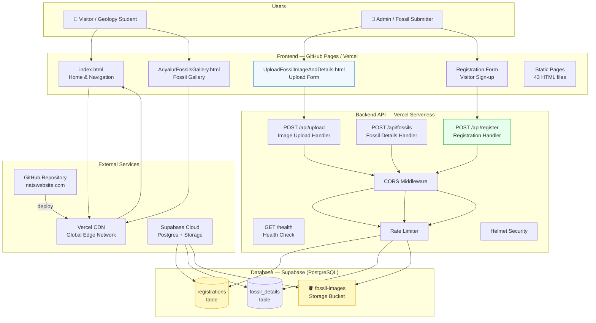
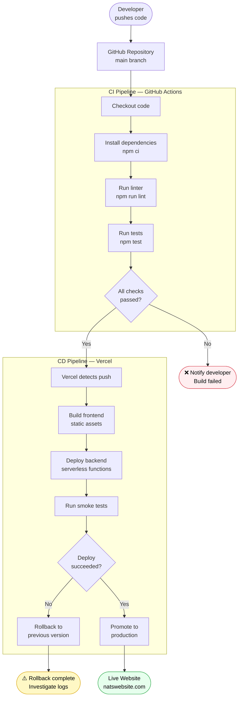
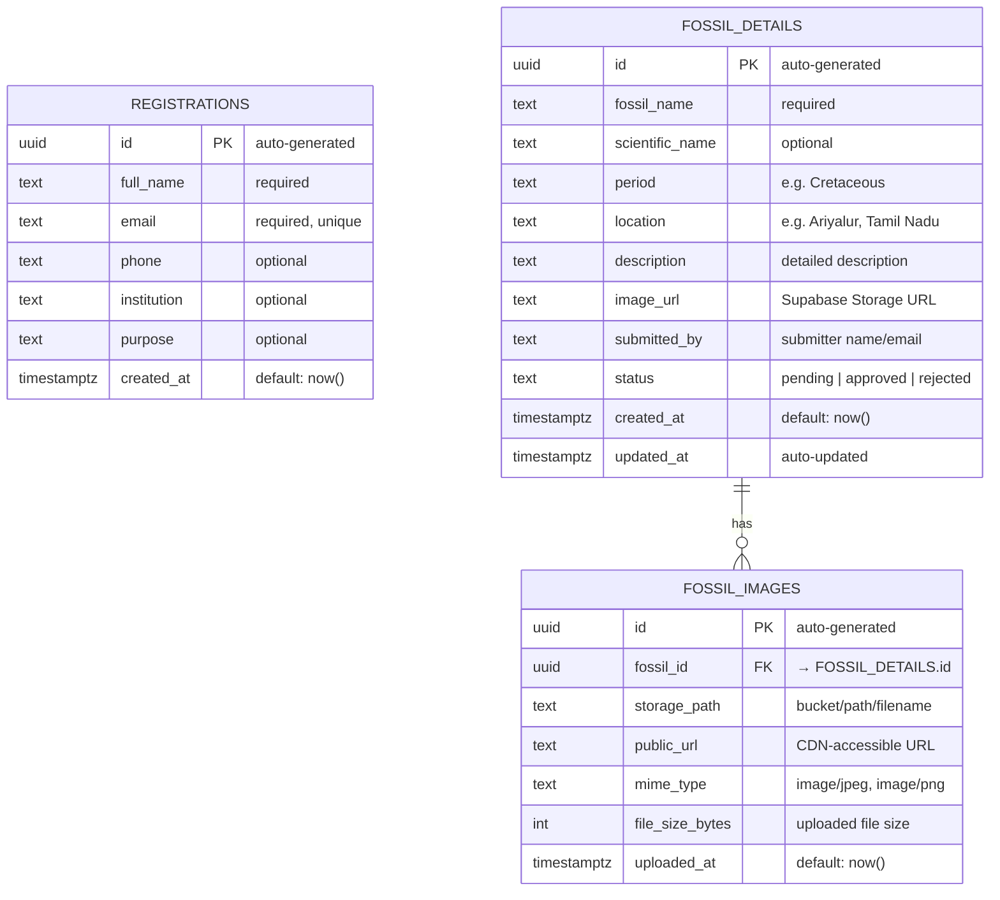
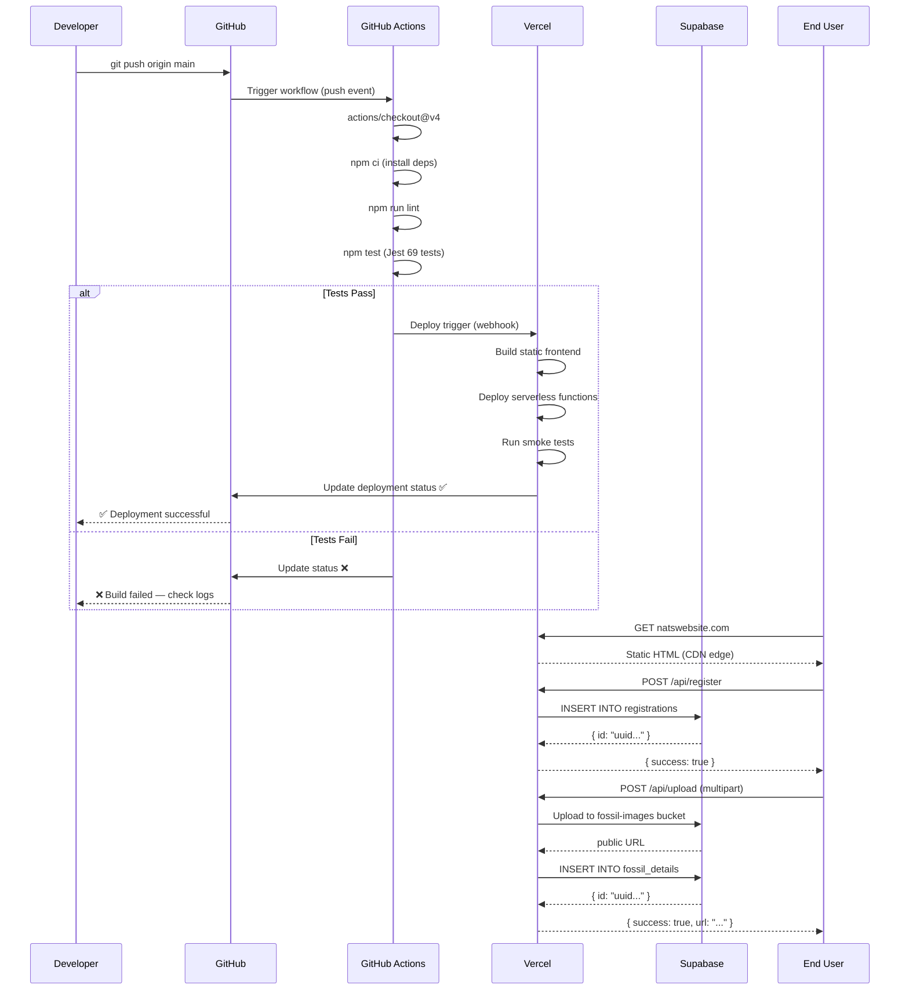

# Ariyalur Geology Website — Architecture & Visual Diagrams

This document contains visual diagrams for the Ariyalur Geology website system,
covering system architecture, data flow, deployment pipeline, database schema,
CI/CD workflow, and request flow.

---

## 1. System Architecture



---

## 2. Data Flow Diagram

```mermaid
flowchart LR
    subgraph "Registration Flow"
        R1([User fills\nRegistration Form])
        R2{Form\nValidation}
        R3[POST /api/register\nJSON body]
        R4{Backend\nValidation}
        R5[(Insert into\nregistrations)]
        R6([Success /\nError Response])

        R1 --> R2
        R2 -->|Invalid| R1
        R2 -->|Valid| R3
        R3 --> R4
        R4 -->|Invalid| R6
        R4 -->|Valid| R5
        R5 --> R6
    end

    subgraph "Fossil Upload Flow"
        F1([User fills\nFossil Details Form])
        F2{File &\nForm Validation}
        F3[POST /api/upload\nmultipart/form-data]
        F4[Upload image to\nSupabase Storage]
        F5[Get public\nimage URL]
        F6[POST /api/fossils\nwith image URL]
        F7[(Insert into\nfossil_details)]
        F8([Success /\nError Response])

        F1 --> F2
        F2 -->|Invalid| F1
        F2 -->|Valid| F3
        F3 --> F4
        F4 --> F5
        F5 --> F6
        F6 --> F7
        F7 --> F8
    end

    subgraph "Gallery Display Flow"
        G1([User visits\nFossils Gallery])
        G2[GET /api/fossils\nquery params]
        G3[(SELECT from\nfossil_details)]
        G4[Build JSON\nresponse]
        G5([Render gallery\ncards with images])

        G1 --> G2
        G2 --> G3
        G3 --> G4
        G4 --> G5
    end
```



---

## 3. Deployment Pipeline



---

## 4. Database Schema Diagram



> **Supabase SQL to create these tables** — run in the Supabase SQL Editor:
>
> ```sql
> -- Registrations
> CREATE TABLE registrations (
>   id           UUID PRIMARY KEY DEFAULT gen_random_uuid(),
>   full_name    TEXT NOT NULL,
>   email        TEXT NOT NULL UNIQUE,
>   phone        TEXT,
>   institution  TEXT,
>   purpose      TEXT,
>   created_at   TIMESTAMPTZ DEFAULT NOW()
> );
>
> -- Fossil details
> CREATE TABLE fossil_details (
>   id              UUID PRIMARY KEY DEFAULT gen_random_uuid(),
>   fossil_name     TEXT NOT NULL,
>   scientific_name TEXT,
>   period          TEXT,
>   location        TEXT,
>   description     TEXT,
>   image_url       TEXT,
>   submitted_by    TEXT,
>   status          TEXT DEFAULT 'pending',
>   created_at      TIMESTAMPTZ DEFAULT NOW(),
>   updated_at      TIMESTAMPTZ DEFAULT NOW()
> );
>
> -- Fossil images (optional extended tracking)
> CREATE TABLE fossil_images (
>   id               UUID PRIMARY KEY DEFAULT gen_random_uuid(),
>   fossil_id        UUID REFERENCES fossil_details(id) ON DELETE CASCADE,
>   storage_path     TEXT NOT NULL,
>   public_url       TEXT NOT NULL,
>   mime_type        TEXT,
>   file_size_bytes  INT,
>   uploaded_at      TIMESTAMPTZ DEFAULT NOW()
> );
>
> -- Row-Level Security (recommended)
> ALTER TABLE registrations  ENABLE ROW LEVEL SECURITY;
> ALTER TABLE fossil_details ENABLE ROW LEVEL SECURITY;
> ALTER TABLE fossil_images  ENABLE ROW LEVEL SECURITY;
> ```

---

## 5. CI/CD Workflow Visualization



---

## 6. Request Flow Diagram

```mermaid
flowchart LR
    subgraph "Client Browser"
        B1[HTML Form]
        B2[JavaScript fetch()]
        B3[Response handler]
    end

    subgraph "Vercel Edge Network"
        E1[CDN / Edge Cache]
        E2[Serverless Function\nCold Start ~ 200ms]
        E3[Warm Function\nResponse ~ 50ms]
    end

    subgraph "Backend Middleware Stack"
        M1[Helmet\nSecurity headers]
        M2[CORS\nOrigin validation]
        M3[Rate Limiter\n100 req/15min]
        M4[JSON Parser\nbody-parser]
        M5[Route Handler]
        M6[Error Handler]
    end

    subgraph "Supabase"
        S1[PostgREST API]
        S2[PostgreSQL DB]
        S3[Storage API]
        S4[S3-compatible CDN]
    end

    B1 -->|submit| B2
    B2 -->|HTTPS request| E1
    E1 -->|static asset| B3
    E1 -->|API route| E2
    E2 --> M1 --> M2 --> M3 --> M4 --> M5
    M5 -->|DB query| S1 --> S2
    M5 -->|file upload| S3 --> S4
    S2 -->|result| M5
    S4 -->|public URL| M5
    M5 --> E3
    M6 -->|on error| E3
    E3 -->|JSON response| B3
    B3 -->|update UI| B1

    style E2 fill:#fff8c5,stroke:#d9a40c
    style S2 fill:#f0f7ff,stroke:#0366d6
```

---

## Architecture Decision Records

| Decision | Choice | Reason |
|----------|--------|--------|
| Cloud DB | **Supabase (PostgreSQL)** | Free tier, built-in REST API, storage included, real-time subscriptions |
| Frontend | **GitHub Pages + Vercel** | Already deployed, CDN, free, no server management |
| Backend  | **Node.js/Express on Vercel** | Serverless, scales to zero, integrates with Vercel frontend |
| Storage  | **Supabase Storage** | Co-located with DB, built-in CDN, RLS policies |
| Auth     | **Supabase RLS** | Row-level security without a separate auth service |
| CI/CD    | **GitHub Actions** | Native to GitHub, free for public repos |
