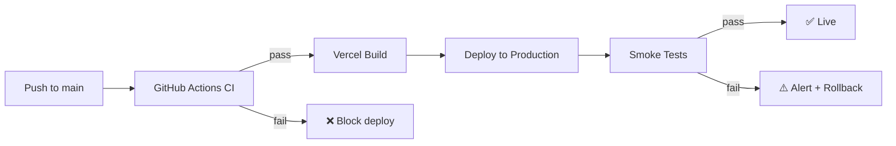

# Ariyalur Geology Website — CI/CD Pipeline Guide

This guide explains every stage of the build, test, deployment, rollback, and
monitoring pipeline for the Ariyalur Geology website.

---

## Pipeline Overview

```
Code Push → CI (GitHub Actions) → CD (Vercel) → Production → Monitoring
```

---

## 1. Pipeline Stages

| Stage | Tool | Trigger | Duration |
|-------|------|---------|---------|
| **Source Control** | GitHub | Developer push | instant |
| **Lint** | ESLint | Every push/PR | ~10 s |
| **Unit Tests** | Jest | Every push/PR | ~30 s |
| **Integration Tests** | Jest + Supertest | Every push/PR | ~45 s |
| **Build** | Vercel CLI | Push to `main` | ~60 s |
| **Deploy Preview** | Vercel | Every PR | ~90 s |
| **Deploy Production** | Vercel | Push to `main` | ~90 s |
| **Smoke Tests** | curl / verify-deployment.sh | Post-deploy | ~30 s |
| **Monitoring** | Vercel Analytics + Supabase | Continuous | — |

---

## 2. Build Process Flow

### 2.1 Frontend Build

The frontend is **static HTML** — no build step is required. Vercel serves files
directly from the repository root.

```
Repository Root
├── index.html                  → served at /
├── AriyalurFossilsGallery.html → served at /AriyalurFossilsGallery.html
├── UploadFossilImageAndDetails.html
├── *.html (43 pages total)
└── *.jpg / *.png / *.mp4
```

**Vercel routing** (configured in `VERCEL.JSON`):

```json
{
  "rewrites": [
    { "source": "/(.*)", "destination": "/" }
  ]
}
```

### 2.2 Backend Build

The backend is a Node.js/Express application deployed as **Vercel Serverless
Functions**.

```
backend/
├── server.js          → entry point
├── routes/
│   ├── register.js    → POST /api/register
│   ├── fossils.js     → GET/POST /api/fossils
│   └── upload.js      → POST /api/upload
├── middleware/
│   ├── cors.js
│   ├── rateLimiter.js
│   └── errorHandler.js
├── utils/
│   ├── supabase.js    → Supabase client singleton
│   └── validators.js  → Input validation helpers
└── tests/             → Jest test files
```

**Build commands:**

```bash
cd backend
npm ci              # Install exact versions from package-lock.json
npm run lint        # ESLint check
npm test            # Jest 69 tests across 6 files
```

---

## 3. Testing Pipeline

### 3.1 Test Structure

```
backend/tests/
├── api.test.js           # API route integration tests
├── database.test.js      # Supabase DB connectivity tests
├── email.test.js         # Email notification tests
├── integration.test.js   # End-to-end workflow tests
├── performance.test.js   # Response time benchmarks
└── upload.test.js        # File upload tests
```

### 3.2 Running Tests

```bash
# All tests
cd backend && npm test

# With coverage report
cd backend && npm test -- --coverage

# Single test file
cd backend && npm test -- tests/api.test.js

# Watch mode (during development)
cd backend && npm test -- --watch
```

### 3.3 Coverage Targets

| Category | Target |
|----------|--------|
| Statements | ≥ 80% |
| Branches | ≥ 75% |
| Functions | ≥ 85% |
| Lines | ≥ 80% |

### 3.4 GitHub Actions Workflow

```yaml
# .github/workflows/backend-ci.yml
name: Backend CI

on:
  push:
    branches: [main]
    paths:
      - 'backend/**'
  pull_request:
    branches: [main]
    paths:
      - 'backend/**'

jobs:
  test:
    runs-on: ubuntu-latest
    steps:
      - uses: actions/checkout@v4

      - name: Use Node.js 20
        uses: actions/setup-node@v4
        with:
          node-version: '20'
          cache: 'npm'
          cache-dependency-path: backend/package-lock.json

      - name: Install dependencies
        run: cd backend && npm ci

      - name: Run lint
        run: cd backend && npm run lint

      - name: Run tests
        env:
          SUPABASE_URL: ${{ secrets.SUPABASE_URL }}
          SUPABASE_SERVICE_ROLE_KEY: ${{ secrets.SUPABASE_SERVICE_ROLE_KEY }}
        run: cd backend && npm test -- --coverage

      - name: Upload coverage
        uses: actions/upload-artifact@v4
        with:
          name: coverage
          path: backend/coverage/
```

---

## 4. Deployment Stages

### 4.1 Preview Deployments (Pull Requests)

Every pull request automatically gets a **preview deployment** from Vercel:

1. Open a PR → Vercel creates a unique URL (e.g., `https://ariyalur-git-my-feature.vercel.app`)
2. GitHub Actions CI runs tests
3. Vercel posts deployment URL as a PR comment
4. Review the preview before merging

### 4.2 Production Deployment



**Production deployment checklist:**

- [ ] All CI checks green
- [ ] Preview deployment reviewed (if applicable)
- [ ] Database migrations applied (if schema changed)
- [ ] Environment variables updated in Vercel (if new vars added)

### 4.3 Environment Variables in Vercel

Set these in **Vercel → Project → Settings → Environment Variables**:

| Variable | Environment | Notes |
|----------|-------------|-------|
| `SUPABASE_URL` | Production, Preview | Supabase project URL |
| `SUPABASE_SERVICE_ROLE_KEY` | Production, Preview | Keep secret! |
| `NODE_ENV` | Production | Set to `production` |
| `CORS_ORIGIN` | Production | `https://natswebsite.com` |
| `SUPABASE_STORAGE_BUCKET` | Production, Preview | `fossil-images` |

### 4.4 Manual Deployment (emergency)

```bash
# Install Vercel CLI
npm install -g vercel

# Deploy to preview
vercel

# Deploy to production
vercel --prod
```

---

## 5. Rollback Procedures

### 5.1 Automatic Rollback

Vercel keeps the last **10 deployments** and can instantly roll back.

**Via Vercel Dashboard:**

1. Go to <https://vercel.com> → Your Project → Deployments
2. Find the last known good deployment
3. Click **"Promote to Production"**
4. Rollback is instant (no rebuild required)

**Via Vercel CLI:**

```bash
# List recent deployments
vercel ls

# Roll back to a specific deployment
vercel rollback <deployment-url>
```

### 5.2 Database Rollback

If a database migration caused issues:

```sql
-- Example: revert a column addition
ALTER TABLE fossil_details DROP COLUMN IF EXISTS new_column;

-- Example: restore deleted rows from a backup
INSERT INTO fossil_details SELECT * FROM fossil_details_backup WHERE ...;
```

**Always back up before migrations:**

```bash
# Supabase supports point-in-time recovery (PITR) on paid plans.
# For the free tier, manually export before migrations:
# Supabase Dashboard → Database → Backups → Download
```

### 5.3 Emergency Procedures

| Scenario | Action |
|----------|--------|
| API returns 500 errors | Rollback Vercel deployment |
| DB connection failing | Check Supabase dashboard for outages |
| Too many 429 errors | Increase rate limit temporarily |
| Image uploads failing | Check storage bucket permissions |
| Frontend 404s | Check Vercel routing / CNAME |

---

## 6. Monitoring Integration

### 6.1 Vercel Analytics

Automatically enabled for all Vercel projects. View at:
**Vercel → Project → Analytics**

Metrics available:
- Page views and unique visitors
- Core Web Vitals (LCP, FID, CLS)
- Top pages and referrers
- Country/device breakdown

### 6.2 Supabase Monitoring

Available at **Supabase → Project → Reports**:

- API request count and latency
- DB query performance
- Storage usage
- Auth events (if used)

### 6.3 Custom Health Check

The `/health` endpoint returns:

```json
{
  "status": "ok",
  "timestamp": "2024-01-15T10:30:00.000Z",
  "version": "1.0.0",
  "database": "connected",
  "storage": "connected"
}
```

Set up an external uptime monitor to call this endpoint every 5 minutes.

**Free uptime monitoring services:**
- [UptimeRobot](https://uptimerobot.com) — free, 5-minute intervals
- [Freshping](https://freshping.io) — free, 1-minute intervals
- [Better Uptime](https://betteruptime.com) — free tier available

### 6.4 Log Management

```bash
# View Vercel function logs (real-time)
vercel logs --follow

# View last 100 lines
vercel logs --limit 100

# Filter by level
vercel logs --level error
```

Local log files:
```
backend/logs/
├── app.log      # General application logs
├── error.log    # Error-level logs only
└── access.log   # HTTP access logs
```

---

## 7. Pipeline Performance Benchmarks

| Metric | Target | Alert Threshold |
|--------|--------|-----------------|
| CI pipeline total | < 3 min | > 10 min |
| Unit tests | < 30 s | > 2 min |
| Integration tests | < 60 s | > 5 min |
| Vercel build | < 90 s | > 5 min |
| Frontend TTFB | < 500 ms | > 2 s |
| API response time | < 500 ms | > 2 s |
| API cold start | < 3 s | > 10 s |

---

## 8. Branch Strategy

```
main              → production (auto-deploy to Vercel)
  └── feature/*   → development (auto-deploy to preview URL)
  └── fix/*       → bug fixes (auto-deploy to preview URL)
  └── hotfix/*    → emergency fixes (merge directly to main)
```

**Commit message convention:**

```
feat: add fossil search endpoint
fix: correct CORS headers for Safari
docs: update PIPELINE_GUIDE.md
test: add upload integration tests
chore: bump @supabase/supabase-js to 2.40
```
